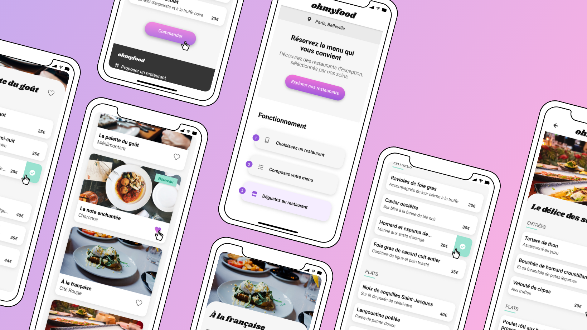

# OhMyFood!

Development of a "mobile first" website listing the menus of gourmet restaurants, ou can navigate the different pages of the site and move your mouse over several elements to see the different animations.

## Technologies used for this project

HTML5, CSS3, SCSS, Visual Studio Code, Git, GitHub, Responsive Design
